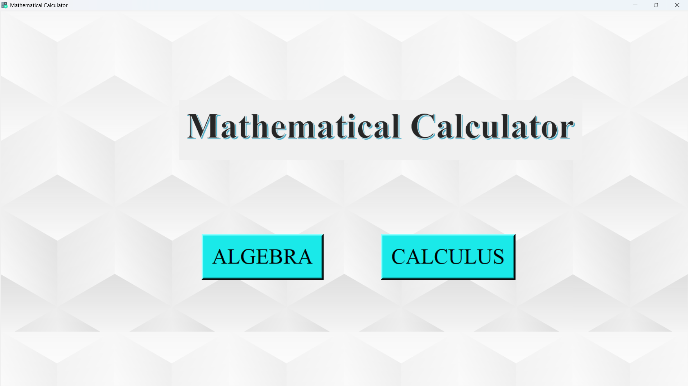
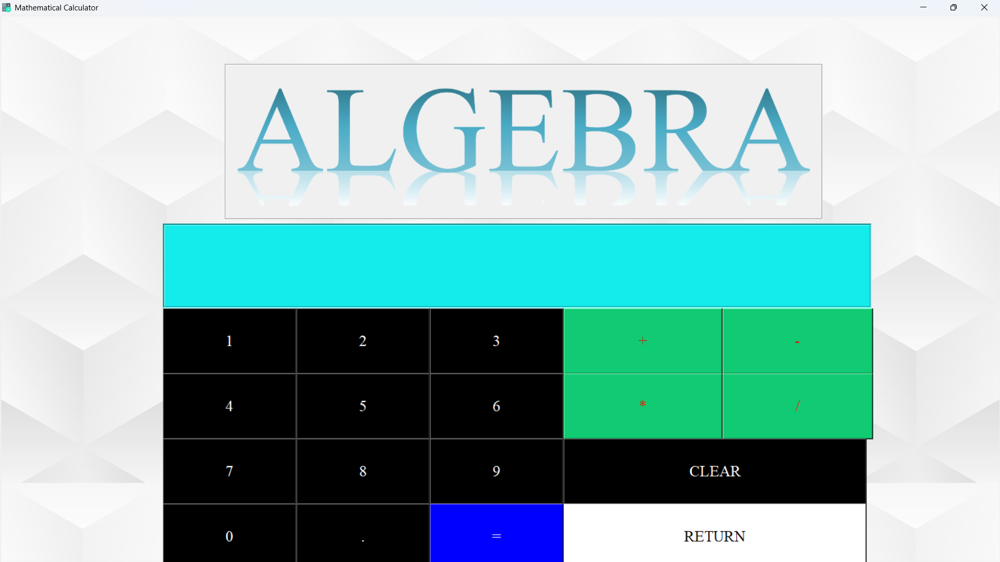
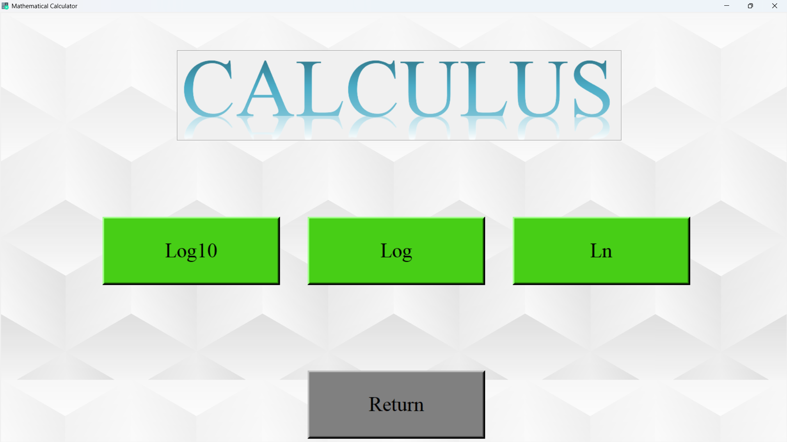
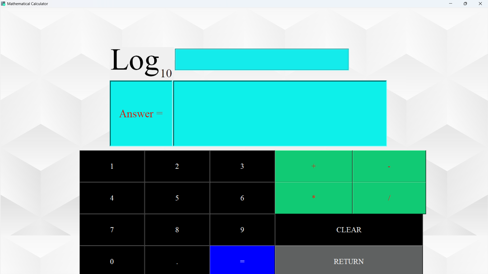
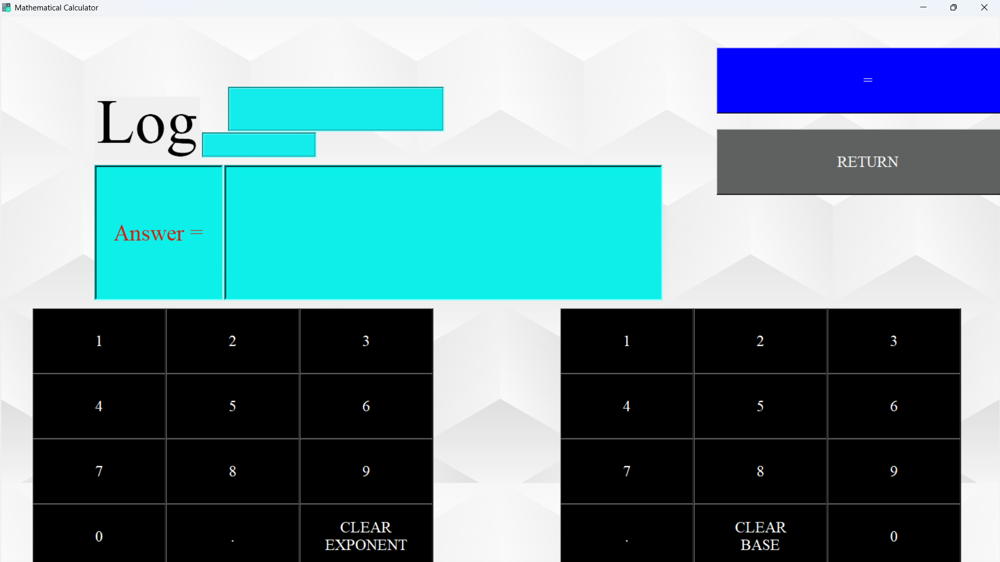
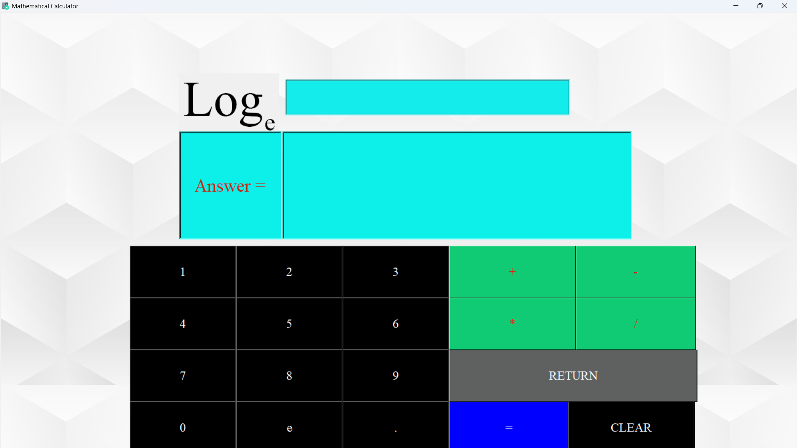

# 📊 Mathematical Calculator

**Mathematical Calculator** is a Python-based GUI application designed to simplify solving algebraic and calculus equations. Developed as a high school computer science project, this tool provides an intuitive interface to perform complex mathematical computations efficiently.

---

## 🚀 Features

- 📐 **Algebraic & Calculus Support**  
  Solve both algebraic expressions and calculus problems effortlessly.

- 💾 **History Tracking**  
  Automatically stores previously calculated equations for future reference.

- 🧑‍🏫 **Educational Utility**  
  Designed to assist students and teachers in solving equations quickly and accurately.

- 🖥️ **User-Friendly Interface**  
  Built using Python's `Tkinter` library, ensuring an easy-to-navigate experience.

---

## 🎯 Objective

The main objectives behind the development of this software were:
- To ease the process of solving mathematical equations.
- To save users valuable time during calculations.
- To provide a simple, accessible, and functional graphical interface.
- To allow users to revisit past calculations at any time.

---

## 🛠️ Built With

- **Python 3**
- **Tkinter** – for creating the graphical user interface (GUI)

---

## 🖼️ Screenshots







---

## 📚 How to Run

1. **Clone the repository**  
   ```bash
   git clone https://github.com/yourusername/mathematical-calculator.git
   cd mathematical-calculator
   ```
2. **Install the required libraries**
  ```bash
  pip install tkinter
  ```
  ```bash
  pip install mysql.connector
  ```  
3. **Run the Application**
   ```bash
   python Mathematical_calculator.py
   ```
4. **Note**
- In the Mathematical_calculator.py file the mysql part is commented out, Fill in your username and password to use it.


## 🙏 Acknowledgements

- Guided by **Ms. Shipra Ranjan** – Computer Science Teacher

- Presentation design resources from:
  - [SlidesCarnival](https://slidescarnival.com)
  - [RealPython – Tkinter Tutorial](https://realpython.com/python-gui-tkinter/)
  - [GeeksForGeeks](https://www.geeksforgeeks.org)
## 📄 License

This project is for educational purposes only. Feel free to use or adapt it with attribution.

---

## 👤 Author

**Aditya Prabhakar**  
Class XII-C  
Academic Year: 2022–2023
